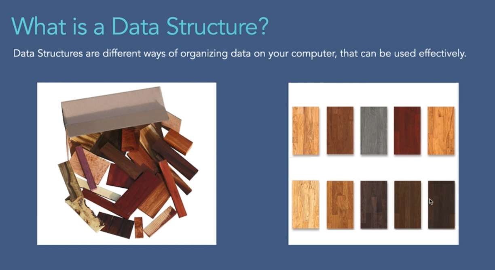
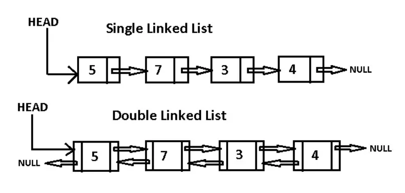
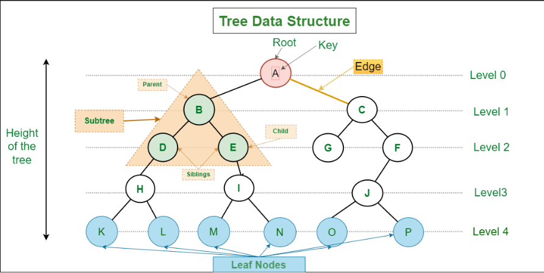
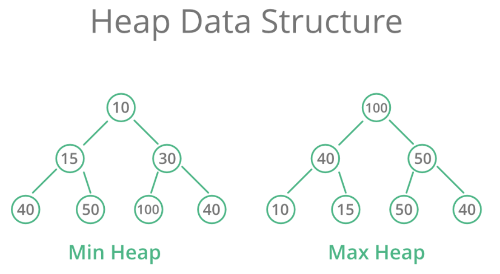
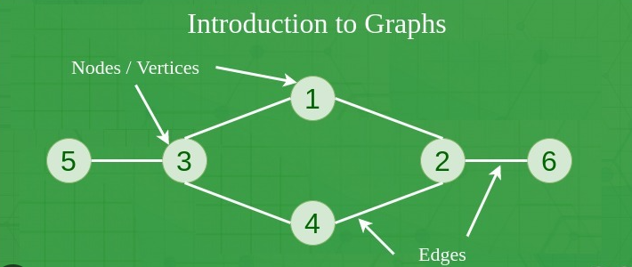
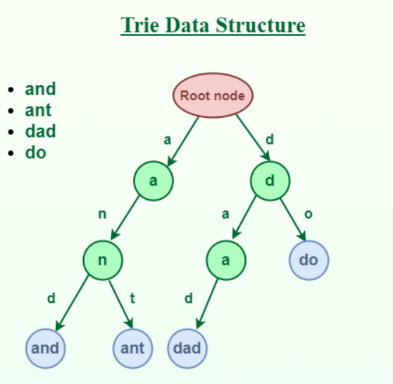
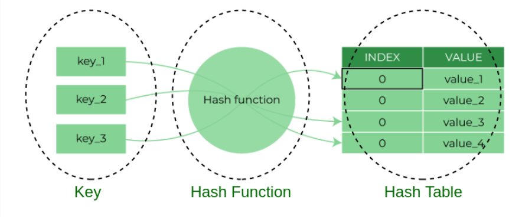
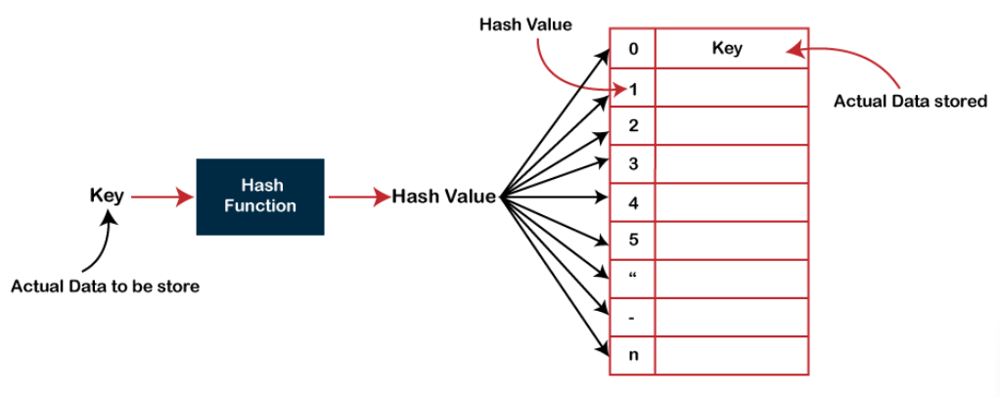

# Data Structure

## Definition

A data structure is a specialized format for organizing, processing, retrieving and storing data. There are several basic and advanced types of data structures, all designed to arrange data to suit a specific purpose. Data structures make it easy for users to access and work with the data they need in appropriate ways. Most importantly, data structures frame the organization of information so that machines and humans can better understand it.

In computer science and computer programming, a data structure may be selected or designed to store data for the purpose of using it with various algorithms. In some cases, the algorithm's basic operations are tightly coupled to the data structure's design. Each data structure contains information about the data values, relationships between the data and -- in some cases -- functions that can be applied to the data.

# Characteristics of data structures
Data structures are often classified by their characteristics. The following three characteristics are examples:

1. Linear or non-linear. This characteristic describes whether the data items are arranged in sequential order, such as with an array, or in an unordered sequence, such as with a graph.
2. Homogeneous or heterogeneous. This characteristic describes whether all data items in a given repository are of the same type. One example is a collection of elements in an array, or of various types, such as an abstract data type defined as a structure in C or a class specification in Java.
3. Static or dynamic. This characteristic describes how the data structures are compiled. Static data structures have fixed sizes, structures and memory locations at compile time. Dynamic data structures have sizes, structures and memory locations that can shrink or expand, depending on the use.
Data types

# Types of Data Structure
The data structure type used in a particular situation is determined by the type of operations that will be required or the kinds of algorithms that will be applied. The various data structure types include the following:

## Array. 
   An array stores a collection of items at adjoining memory locations. Items that are the same type are stored together so the position of each element can be calculated or retrieved easily by an index. Arrays can be fixed or flexible in length.

   

## Stack
A stack stores a collection of items in the linear order that operations are applied. This order could be last in, first out (LIFO) or first in, first out (FIFO).

## Queue 
A queue stores a collection of items like a stack; however, the operation order can only be first in, first out.

## Linked list
A linked list stores a collection of items in a linear order. Each element, or node, in a linked list contains a data item, as well as a reference, or link, to the next item in the list.
Linked list data structure diagram
Linked list data structures are a set of nodes that contain data and the address or a pointer to the next node.

## Tree 
A tree stores a collection of items in an abstract, hierarchical way. Each node is associated with a key value, with parent nodes linked to child nodes -- or subnodes. There is one root node that is the ancestor of all the nodes in the tree.
Binary search tree diagram
A binary search tree is a set of nodes where each has a value and can point to two child nodes.

## Heap 
A heap is a tree-based structure in which each parent node's associated key value is greater than or equal to the key values of any of its children's key values.

## Graph
 A graph stores a collection of items in a nonlinear fashion. Graphs are made up of a finite set of nodes, also known as vertices, and lines that connect them, also known as edges. These are useful for representing real-world systems such as computer networks.

## Trie 
 A trie, also known as a keyword tree, is a data structure that stores strings as data items that can be organized in a visual graph.

## Hash table
 A hash table -- also known as a hash map -- stores a collection of items in an associative array that plots keys to values. A hash table uses a hash function to convert an index into an array of buckets that contain the desired data item.

.........................................................................................................................................................................
# ALGORITHM

## What is an Algorithm?
An algorithm is a process or a set of rules required to perform calculations or some other problem-solving operations especially by a computer. The formal definition of an algorithm is that it contains the finite set of instructions which are being carried in a specific order to perform the specific task. It is not the complete program or code; it is just a solution (logic) of a problem, which can be represented either as an informal description using a Flowchart or Pseudocode.

