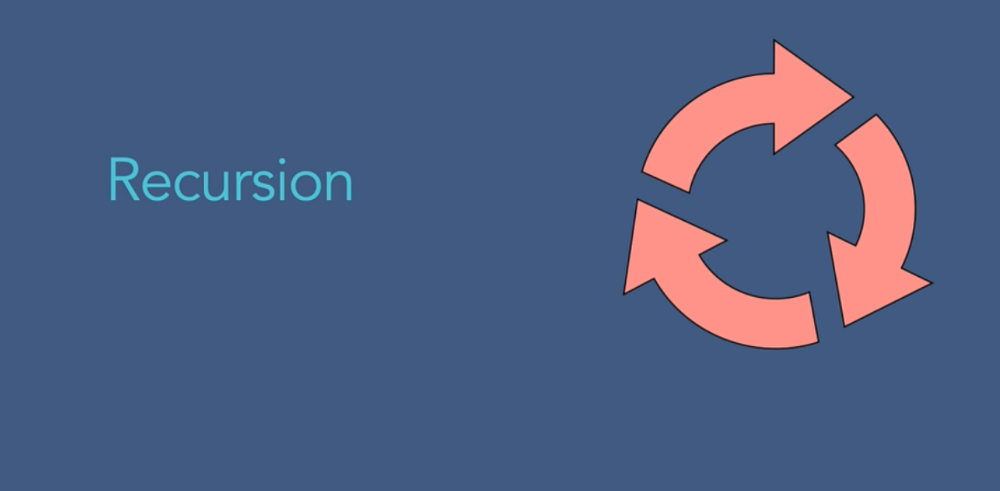
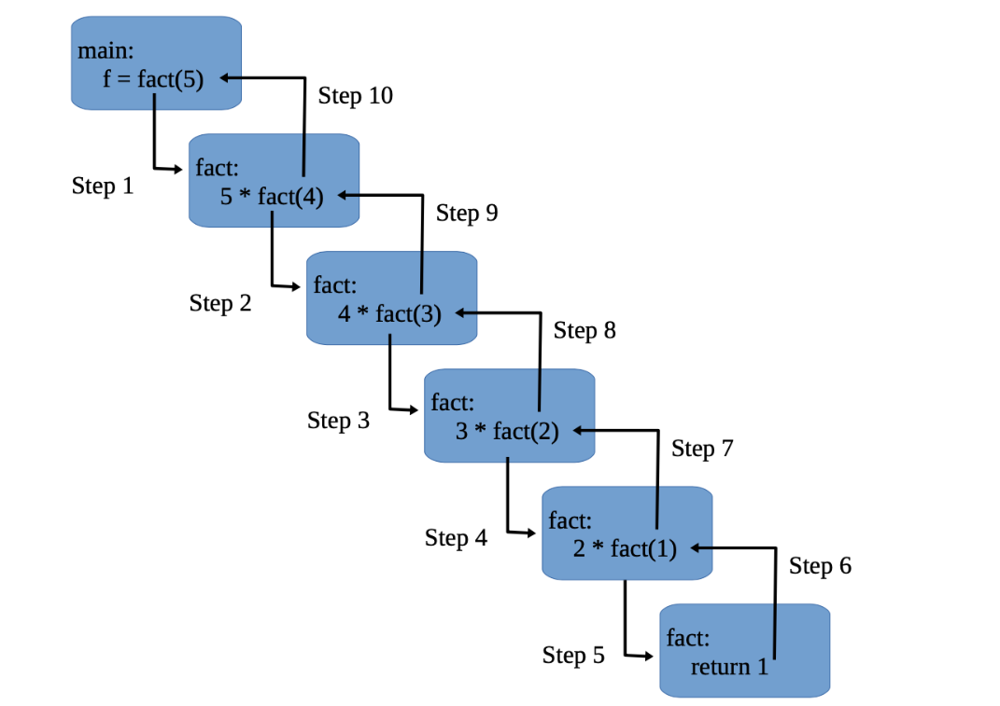

## What is Recursion
In simple words, recursion is a problem solving, and in some cases, a programming technique that has a very special and exclusive property. In recursion, a function or method has the ability to call itself to solve the problem. The process of recursion involves solving a problem by turning it into smaller varieties of itself.

Recursion in stack in data structure is when functions call themselves directly or indirectly.

The process in which a function calls itself could happen directly as well as indirectly. This difference in call gives rise to different types of recursion, which we will talk about a little later. Some of the problems that can be solved using recursion include DFS of Graph, Towers of Hanoi, Different Types of Tree Traversals, and others.

Every step repeats itself at a smaller scale in recursion. Hence, all of them are combined to solve the problem. Recursion in the data structure is one of the most compact and improved strategies for creating function calls or deploying functions in programming. It helps you to implement many functions and algorithms efficiently, at the same time extending clarity on while executing a recursive algorithm in a code which data structure is used.

## Types of recursion

There are only two types of recursion as has already been mentioned. Let us see how they are different from one another. Direct recursion is the simpler way as it only involves a single step of calling the original function or method or subroutine. On the other hand, indirect recursion involves several steps.

The first call is made by the original method to a second method, which in turn calls the original method. This chain of calls can feature a number of methods or functions. In simple words, we can say that there is always a variation in the depth of indirect recursion, and this variation in depth depends on the number of methods involved in the process. 

Direct recursion can be used to call just a single function by itself. On the other hand, indirect recursion can be used to call more than one method or function with the help of other functions, and that too, a number of times. Indirect recursion doesn’t make overhead while its direct counterpart does. 

### Direct Recursion

1) Direct Recursion:

There may be a call to a method in the body of the same method. This method is said to be directly recursive.

Three types of Direct Recursion are:

1. Linear Recursion
2. Binary Recursion
3. Multiple Recursion

### Linear Recursion
Linear recursion starts its execution by testing for base cases’ sets. It then performs a single recursive call. This step involves a test that determines which recursive call to make.  It, therefore, gives you an answer on which data structure is used in recursion. This form of recursion defines every possible recursion call to ensure that it marks progress towards a base case.

### Binary Recursion

Binary recursion takes place when there are two recursive calls for every non-base case.​​​​​​​

### Multiple Recursion

It involves making many recursive calls

## Indirect Recursion:

It happens when functions call some other functions to call the initial function. It includes two easy steps when creating a recursive call. It leads to making functions call functions to make a recursive call. The mutual recursion is called an indirect recursion. Understanding these types of recursion helps you to determine which data structure is used to handle recursion in C.    
