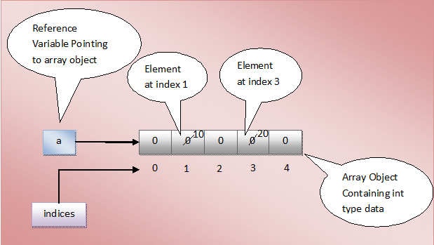
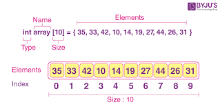

# Array in Detail

## Definition 

An array is an arrangement of numbers, pictures or objects formatted into rows and columns according to their type. In coding and programming, an array is a collection of items, or data, stored in contiguous memory locations, also known as database systems. The purpose of an array is to store multiple pieces of data of the same type together. You can use an array to demonstrate a mathematical property known as the commutative property of multiplication, which illustrates that you can change the order of the factors or elements, and the product of the elements remains the same. 

In computer programming, an array can help you locate and identify where you stored each piece of data, or element, by adding an offset to each value. An offset is a number that represents the difference between the two indexes. Similar to an index in a book, an index in computer programming contains a record of entries with the names of the data items and their locations. Thus, you can identify each element and its location by referring to the index within the array.

## What is an array's size?
An array’s size can be crucial in programming. Software developers and computer programmers use coding programming language, or C language, in a lot of their work, and arrays contain a fixed-size amount of elements in C language. This means you're unable to expand or shrink an array because once you declare its elements, the software statistically allocates a designated amount of space for it.

This is because if you create an array by directly initializing its values, the size of the array will be the exact number of elements you enter into it. If you remove or add an element, you're required to create a new array and enter the exact number of elements in your dataset.

## Types of Arrays

### One-Dimensional
#### The simplest type of arrays, one-dimensional arrays, contains a single row of elements. These arrays are usually indexed from 0 to n-1, where ‘n’ is the size of the array. Utilizing its assigned index number, each element in an array can be conveniently accessed.

### Two-Dimensional
#### Two-dimensional array type are arrays that contain arrays of elements. These are also referred to as matrix arrays since they can be thought of as a grid that lays out the elements into rows and columns. Each element within the two-dimensional array can be accessed individually by its row and column location. This array type is useful for storing data such as tables or pictures, where each element may have multiple associated values.

### Multi-Dimensional
#### Multi-Dimensional arrays are a powerful data structure used to store and manage data organizationally. This type of arrays consist of multiple arrays that are arranged hierarchically. They can have any number of dimensions, the most common being two dimensions (rows and columns), but three or more dimensions may also be used.

## Basic Operations on Arrays
#### Arrays are an important data structure used to store collections of data. Arrays can store multiple types of data, such as integers, strings, floats, and objects. There are several types of arrays in data structure:

### 1.Traversing
##### Traversing arrays involves looping through each element in the array and processing each element one at a time. This allows you to access all array elements and perform tasks such as printing, copying, comparing, or sorting. Moreover, a Data Science Certificate Course can help you understand arrays and their applications.

### 2.Insertion
##### Insertion is the process of adding new elements into an existing array. This can be done by providing an index for where the insertion should occur and then shifting other elements in the array to make space for the insertion.

### 3.Deletion
##### Deletion is the opposite of insertion and involves removing elements from an existing array. After deleting an element, all other elements in the array must be shifted to fill any gaps left from deletion.

### 4.Searching
##### Looking for something specific? Searching is the answer. It's a process of identifying an element from within an array by comparing it to your desired value until you find a match. There are two distinct types of searches: linear and binary search techniques, both offering varying degrees of efficiency when used correctly. Linear search compares each element one after another until a match is found or all elements have been searched.

### 5.Sorting
##### Sorting is a process of arranging elements of an array in either ascending or descending order. Array sorting can be done using different algorithms like bubble sort, insertion sort, selection sort, and quick sort. Bubble sort swaps adjacent elements if they are not ordered correctly, while selection sort finds the smallest element and shifts it to the beginning.

## Advantages of Arrays in Data Dtructure
There are various advantages of using arrays in the data structure. Here are these advantages:

### 1. Time Complexity
Arrays offer O(1) time complexity for access to elements. This makes arrays faster than other data structures, such as linked lists. Also, you can check on Data Science vs. Data Analytics: Key difference between data science & data analytic.

### 2. Cache-Friendly
Due to their contiguous memory locations, arrays are much more cache-friendly than other data structures. Moreover, accessing an element in arrays takes advantage of the temporal locality of references, which results in higher cache hit rates and improved performance.

### 3. Space Efficiency
Arrays occupy the least space compared to other data structures like stacks and linked lists, which require extra space for pointers. Hence, arrays are considered as a very important tool for memory management. The application of arrays can also be seen in various algorithms, such as searching, sorting, and merging.

## Disadvantages of Arrays in Data Structure
Here are the disadvantage of using arrays in data structure:

 1. Upon creation, Arrays are immutably sized - meaning they can never be increased or decreased in size. This can become problematic if the number of elements stored exceeds the initial capacity set for the array.  Arrays are unsuitable for all applications since they only store homogeneous data types. For example, arrays may not be suitable solutions if we want to store different types of data such as integers and strings in the same array.
Accessing elements within arrays is slow compared to other data structures due to their sequential nature. This makes arrays less efficient when large amounts of data must be searched through quickly.
Common Mistakes to Avoid When Using Arrays
The most common mistakes when using arrays include:

2. Not understanding what arrays are: arrays in data structure are data structures that store multiple values of the same type in a linear fashion. The elements of arrays can be accessed using index numbers.
3. Not knowing the types of arrays: arrays come in two main varieties - single-dimensional and multi-dimensional. Single-dimensional arrays store one type of data elements in a single row. Multi-dimensional arrays allow for the storage of multiple elements, each with their unique index numbers.
4. Ignoring application of arrays: arrays have many applications, such as sorting and searching data, storing large amounts of data quickly, and providing quick access to stored information. Arrays can also be used to optimize algorithms and make complex data processing tasks much easier.

## Array Initilization

## Create an Array
To create an array, you can use either a fixed size or dynamic size. In this example, we will demonstrate how to declare and initialize an array

